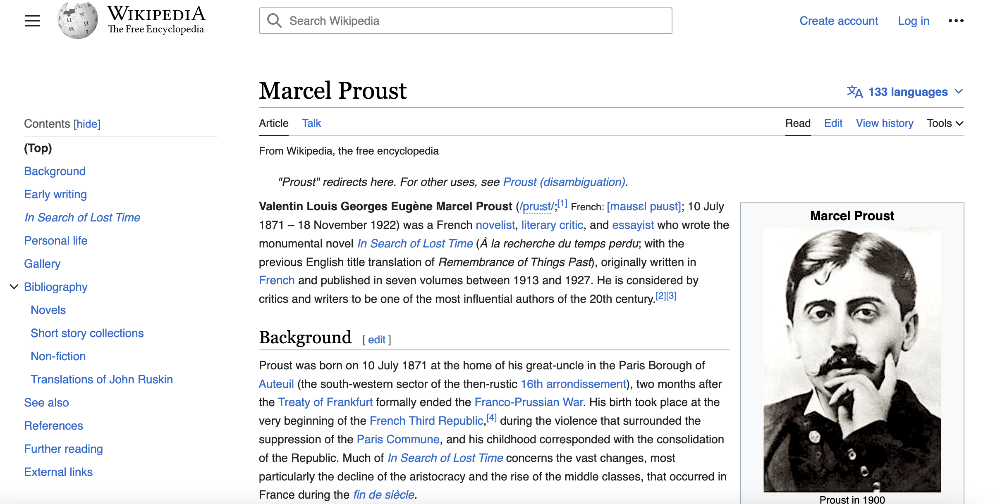

# In Search of Proust

## Description

This is an app for Marcel Proust lovers around the world. *In Search of Lost Time* is a collection of books that are of great importance to me in the sense that they have added a layer of depth in my understanding of the world around me. They are filled with philosophy, a great sense of humour and are just a great companion for anyone navigating life.
One of the aspects that I love in the books is the depiction of places, which is why one of the features of the app will be to represent a map containing places mentioned in the books.
Characters and their intricate identities are also a source of fascination, which is why I intent to have a 'which character of *La Recherche* are you?' based on a few questions asked to the user. 
This project is being built using React.js and I am using the skills acquired during the 16-week edX Skills bootcamp in Front-End Web Development that I just completed.

## Deployment

I have not yet decided which web host is best suited for this app but will continue to update this README when I reach that point.

## Contributing

Feel free to fork my repo and suggest amends that you think are necessary

